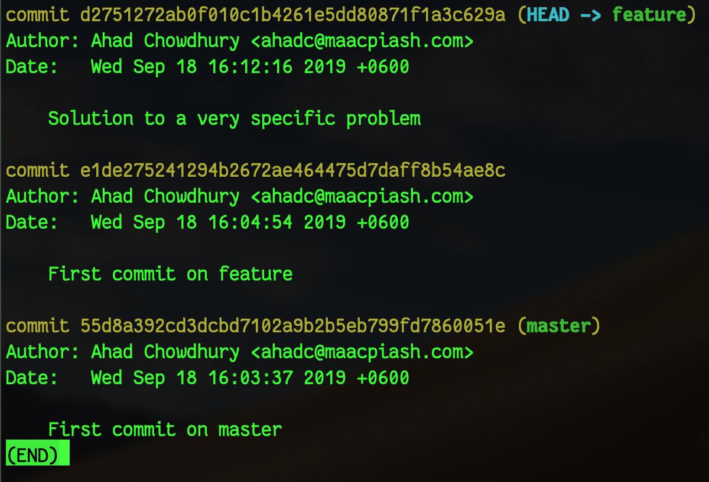

# গিট চেরি-পিক

কোন গিট রিপোজিটরিতে একাধিক [ব্রাঞ্চ](8-git-branch.md) থাকলে এক ব্রাঞ্চের কাজ সহজেই অন্য ব্রাঞ্চে নেওয়া যায় `git cherry-pick` কমান্ড ব্যবহার করে।

ধরা যাক, আমাদের রিপোজিটরিতে `master` ব্রাঞ্চ ছাড়াও আরও দুটো ব্রাঞ্চ আছে: `feature` ও `hotfix`। তিনটি ব্রাঞ্চে আলাদা আলাদাভাবে [লগ](9-git-log.md) খুললে এরকম দেখা যাচ্ছে:

**`master` ব্রাঞ্চ:**


**`feature` ব্রাঞ্চ:**


**`hotfix` ব্রাঞ্চ:**


দেখা যাচ্ছে, `master` ব্রাঞ্চে প্রথম কমিটটি দেওয়ার পরই দুটি আলাদা ব্রাঞ্চ খোলা হয়েছে এবং ব্রাঞ্চ দুটিতে পরস্পর থেকে স্বাধীনভাবে কাজ চলছে।

এখন ধরা যাক, আমরা `feature` ব্রাঞ্চে কাজ করছি, আর অন্য কেউ `hotfix` ব্রাঞ্চে কাজ করছেন। `hotfix` ব্রাঞ্চের `Solution to a very specific problem` কমিটে যে কাজটা করা হয়েছে, সেই কাজটি আমাদের বর্তমান ব্রাঞ্চে যোগ করা প্রয়োজন। এর আগের কমিটটি না হলেও চলবে। তাহলে কীভাবে আমরা সেই কমিটটি পেতে পারি?

এটি পাওয়ার উপায় হলো `git cherry-pick`। উক্ত কমিটের হ্যাশ নাম্বার হচ্ছে `ffe3e1f1e516fe73c913796213cfa0a31c60809a`। তাহলে আমরা আমাদের `feature` ব্রাঞ্চে থাকা অবস্থায় নিচের কমান্ডটি দিতে পারি:

```bash
git cherry-pick ffe3e1f
```

তাহলেই `hotfix` ব্রাঞ্চ থেকে ওই একটি কমিট আমাদের `feature` ব্রাঞ্চে চলে আসবে। এখন যদি আমরা `git log` কমান্ড দেই, তাহলে দেখতে পাবো,



দেখা যাচ্ছে, `hotfix` ব্রাঞ্চ থেকে শুধুমাত্র ওই একটি কমিট `feature` ব্রাঞ্চে যোগ হয়েছে এবং `feature` ব্রাঞ্চে করা আগের কমিটগুলো আগের মতই রয়ে গেছে।

