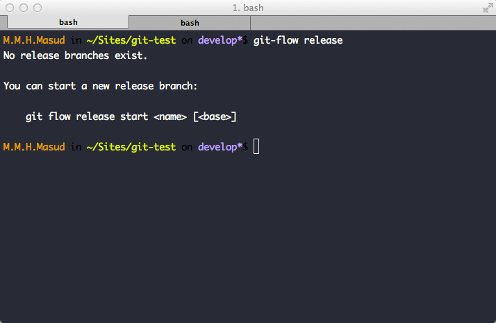
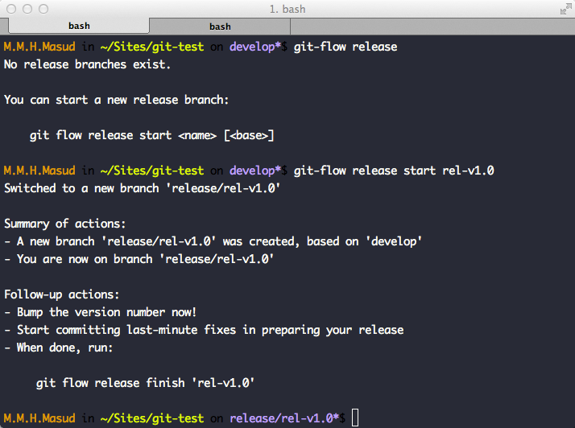
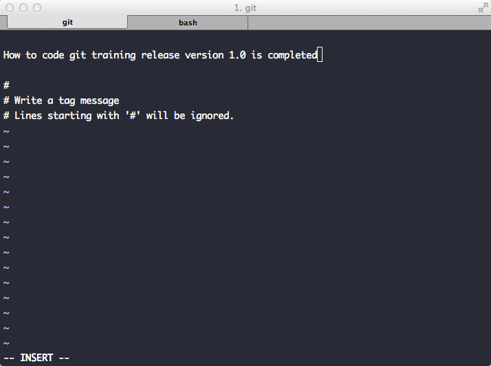
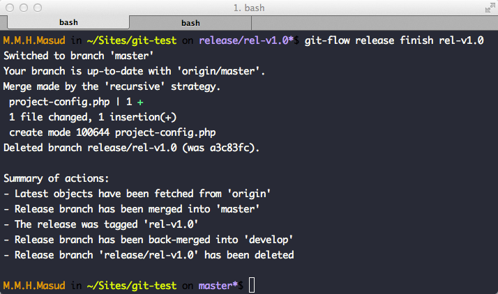

# গিট-ফ্লও রিলিস

গিট-ফ্লও এর আরেকটি প্রয়োজনীয় কমান্ড হোল গিট-ফ্লও রিলিস। এটা দিয়ে আমরা মূলত একটা development branch থেকে production সার্ভারে দেয়ার মত একটা রিলিস তৈরি করি। এটা দিয়ে আমরা খুব সহজে, একটা রিলিস এর নাম্বার দিতে পারি, যেন খুব সহজে আমরা আবার পরবর্তী কোন রিলিএসে ব্যাক করতে পারি।

আমরা যদি গিট-ফ্লও রিলিসের সিনট্যাক্সজানতে চাই, তাহলে আমরা কমান্ড লাইনে গিয়ে নিচের কমান্ড টাইপ করলে হবেঃ

    Git-flow release (press enter)

এবার আমরা নিচের মত একটা স্ক্রীন দেখতে পাব।

এখানে তিনটা টার্ম আছে, যা জানতে হবেঃ

    1. <name> : রিলিসের নাম। যেমনঃ rel-v1.0
    2. [<base>]: এটা একটা ব্রাঞ্চের নাম। মানে আমরা যদি development branch থেকে ব্রাঞ্চ তৈরি না করে, অন্য কোনব্রাঞ্চ থেকে রিলিস তৈরি করতে চাই, তখন ওই ব্রাঞ্চ এর নাম দিব।

এবার আমরা একটা রিলিস তৈরি করব। আমরা ধরে নিচ্ছি, আমাদের ব্রাঞ্চ development। তাহলে আর দেরি না করে নিচের কমান্ডটা রান করি ঃ

    git-flow release start rel-v1.0

এখন আমরা নিচের মত একটা স্ক্রীন দেখতে পাবোঃ

আমরা এখন দেখতে পেলাম একটা নতুন ব্রাঞ্চ rel-v1.0নামের একটা নুতুন ব্রাঞ্চ তৈরি হয়েছে।

আমরা এখন জেতা করতে পারি, এই ব্রাঞ্চটাকে একটা টেস্টিং সার্ভারে দিয়ে দেতে পারি। একদল QA দলকে বলতে পারি, টেস্টিং করতে। যখন, টেস্টিং শেষ হবে, আমরা রিলিসটাকে finish করে দিতে পারি।

এখন জানতে হবে, রিলিস শেষ(finish) করলে কি হয় ঃ
আমরা যখনই কোন রিলিস শেষ করব, গিট-ফ্লও স্বয়ংক্রিয়ভাবে রিলিস ব্রাঞ্চের সকল কোড development branch এবং production branch (master এখানে production branch) এ merge করে দেয়।

এখন আর কথা না বাড়িয়ে, কমান্ডটা রান করে দেখিঃ

    git-flow release finish rel-v1.0

এখন আমরা নিচের মত একটা স্ক্রীন দেখতে পাবোঃ

**গিট মারজ মেসেজ**

**গিট ট্যাগ মেসেজ**

**গিট ফিনিশ শেষ**

এখন আমরা একটু খেয়াল করে **summary of Actions** এর দিকে খেয়াল করে দেখি। এখানে আসলে গিট-ফ্লও কি কি কাজ করেছে, তার একটা সারাংশ তুলে ধরেছে। এবং শব শেষে মাস্টার ব্রাঞ্চ এ শিফট করছে। মানে, rel-v1.0 এর সকল কোড এখন (master) মাস্টার ব্রাঞ্চেও  আছে এবং development ব্রাঞ্চে ও আছে।
