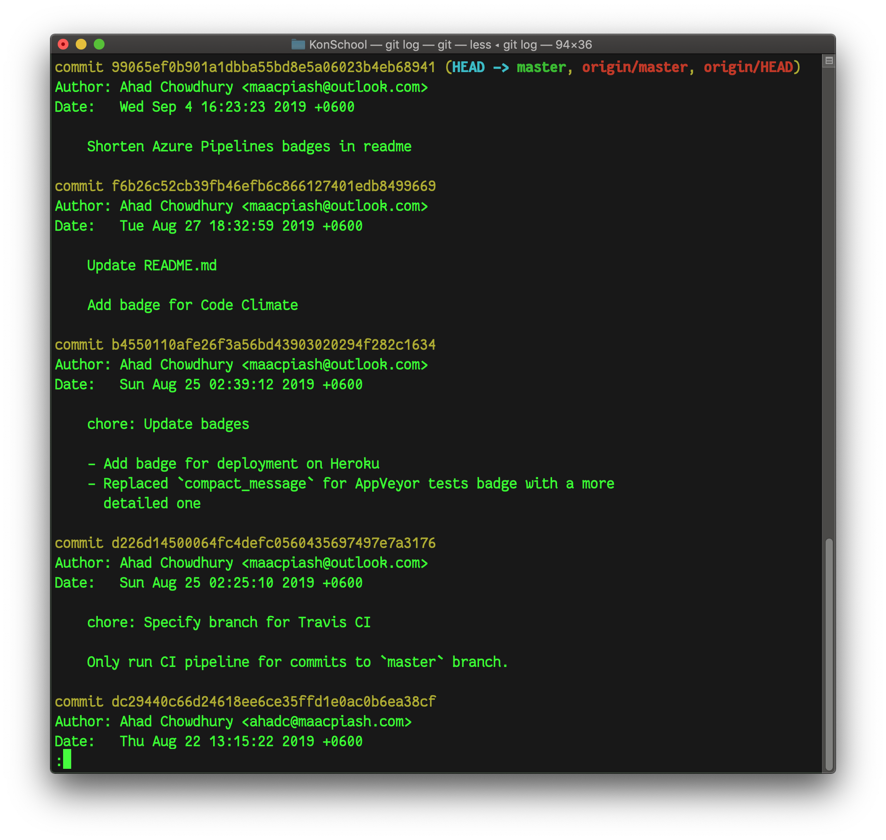
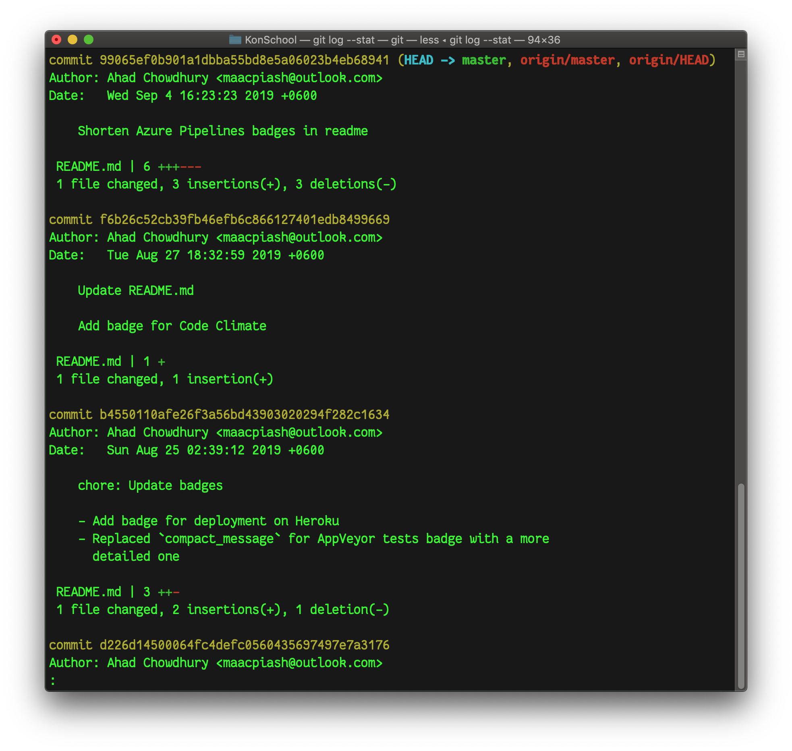

# গিট লগ

গিট লগ কমান্ডের সাহায্যে গিট রিপোজিটরিতে রাখা সবগুলো কমিটের একটা বিস্তারিত তালিকা দেখা যায়।

## সংক্ষিপ্ত বিবরণ সহ কমিটের তালিকা দেখা

শুধুমাত্র `git log` কমান্ড দিলে আমরা রিপোজিটরির সবগুলো কমিটের একটি বিস্তারিত তালিকা দেখতে পারবো। এখানে আমাদের কমিট হ্যাশ নাম্বার, ব্র্যাঞ্চ, কমিটটির রচয়িতা, তার ইমেইল অ্যাড্রেস, কমিট দেওয়ার তারিখ ও সময় এবং কমিট মেসেজ দেখা যাবে:



লিনাক্স-ভিত্তিক অপারেটিং সিস্টেম বা ম্যাকওএসে এই লগ ডিফল্টভাবে Vim টেক্সট এডিটরে ওপেন হবে। এখানে আমরা মাউস ব্যবহার করে অথবা কীবোর্ডের J ও K কী দুটি ব্যবহার করে উপরে-নিচে স্ক্রোল করতে পারি। এখান থেকে বের হতে চাইলে Q প্রেস করবো।

আমরা যদি এগুলোর পাশাপাশি কোন কমিটে কত লাইনের পরিবর্তন হয়েছে দেখতে চাই, তাহলে নিচের কমান্ডটি দেবো।

```bash
git log --stat
```



এখানে সংখ্যাটি মোট কত লাইনের পরিবর্তন হয়েছে তা নির্দেশ করে। `+` ও `-` চিহ্ন দিয়ে কী পরিমাণ লাইনের সংযোজন-বিয়োজন হয়েছে তার একটা আনুপাতিক ধারণা পাওয়া যায়।

## কমিটের বিস্তারিত বর্ণনা দেখা

আমরা যদি প্রতিটি কমিটের বিস্তারিত বর্ণনা দেখতে চাই, অর্থাৎ কোন কমিটে কী কী ফাইলে কী কী পরিবর্তন হয়েছে দেখতে চাই, তাহলে আমরা `--patch` ফ্ল্যাগটি যোগ করে দেবো। তাহলে কমান্ডটি দাঁড়াচ্ছে,

```bash
git log --patch
```


এখানেও `+` ও `-` চিহ্ন দিয়ে লাইনের সংযোজন-বিয়োজন বোঝানো হয়েছে। এখানে দেখা যাচ্ছে, প্রথম কমিটটিতে লাল লাইনগুলো মুছে ফেলে সেখানে সবুজ লাইনগুলো লেখা হয়েছে। এখানেও `J` ও `K` কী-দুটো ব্যবহার করে উপরে-নিচে স্ক্রোল করা যায় এবং `Q` কী প্রেস করে বেরিয়ে আসা যায়।

কমান্ডটি সংক্ষেপে দেওয়া যেতে পারে এভাবে:

```bash
git log -p
```

## শুধু কমিটের মেসেজগুলো দেখা

আমাদের গিট রিপোজিটরিতে প্রতিটি কমিটেরই একটি মেসেজ থাকে, যেটা দিয়ে আমরা সেই কমিটে কী কাজ করেছি তার একটা ধারণা পাওয়া যায়। আমরা যদি কমিটের বিস্তারিত বর্ণনা না দেখে শুধুমাত্র কমিট মেসেজগুলো এক লাইনে দেখতে চাই, তাহলে নিচের কমান্ডটি ব্যবহার করবো।

```bash
git log --oneline
```


এখানে কমিটগুলোর হ্যাশের সংক্ষিপ্ত রূপ ও কমিট মেসেজের প্রথম লাইনটা দেখা যাচ্ছে। কমিট মেসেজে একাধিক লাইন থাকলে শুধু প্রথম লাইনটাই দেখাবে।

## একটি নির্দিষ্ট কমিটের বিস্তারিত বিবরণ দেখা

আমরা যদি শুধু একটা নির্দিষ্ট কমিটের বিস্তারিত বিবরণ দেখতে চাই, তাহলে `git show (commit hash)` কমান্ড দিয়ে সেটা দেখতে পারি।

ধরা যাক, উপরের উদাহরণে যে কমিটটিতে `Add unit test for Schools Controller` মেসেজ দেওয়া আছে, সেই কমিটের আওতায় কী কী কাজ করা হয়েছিলো, সেটা আমরা দেখতে চাচ্ছি। দেখা যাচ্ছে, ওই কমিটটির হ্যাশ নাম্বার `6bab78a`। তাহলে আমরা কমান্ড লিখতে পারি,

```bash
git show 6bab78a
```

তাহলে আমরা নিচের মত করে ওই কমিটের যাবতীয বিবরণ দেখতে পারবো।


খেয়াল করে দেখবেন, কমিটটির পুরো হ্যাশ নাম্বার হচ্ছে `6bab78a3060e9abe30631a03b75fac043927b8a4`। কিন্তু এখানে কমান্ড দেওয়ার সময় পুরো হ্যাশ নাম্বারটা দেওয়ার প্রয়োজন হয় নি। গিট নিয়ে কাজ করার সময় যে কোন ক্ষেত্রে যদি আপনাকে কোন কমিট নির্দিষ্ট করে বলে দিতে হয়, তাহলে আপনি শুধু সেই কমিট হ্যাশ নাম্বারের প্রথম কয়েকটি ডিজিট বা অক্ষর লিখে দিলেই চলবে, যদি না সেই অক্ষরগুলো অন্য কোন কমিটের হ্যাশ নাম্বারের শুরুতে থাকে।

